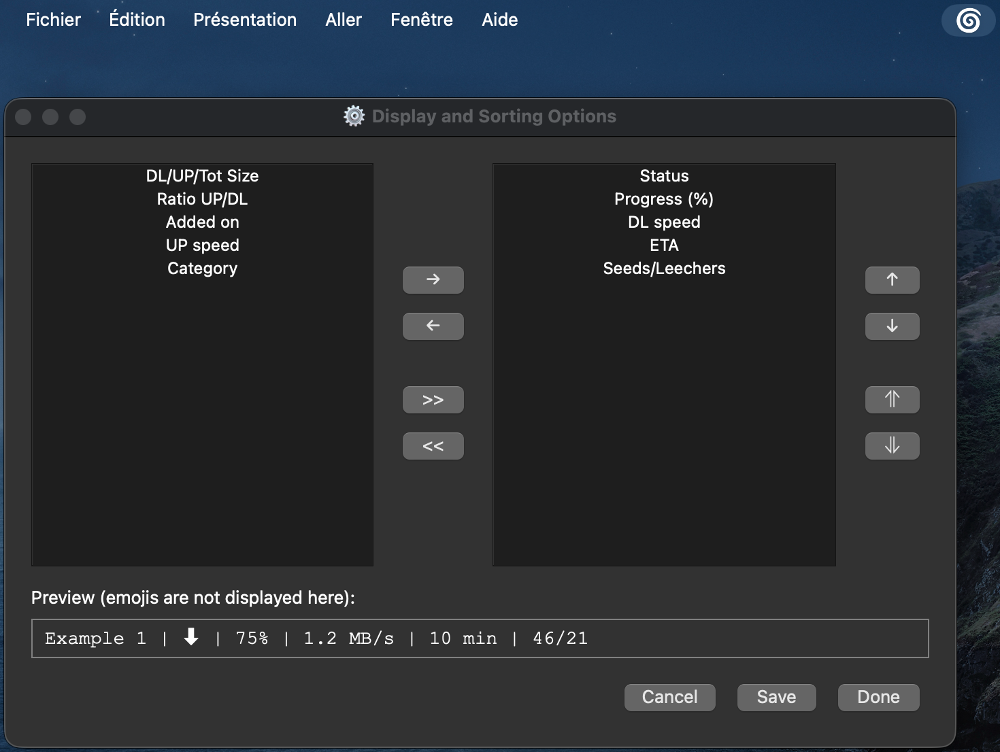
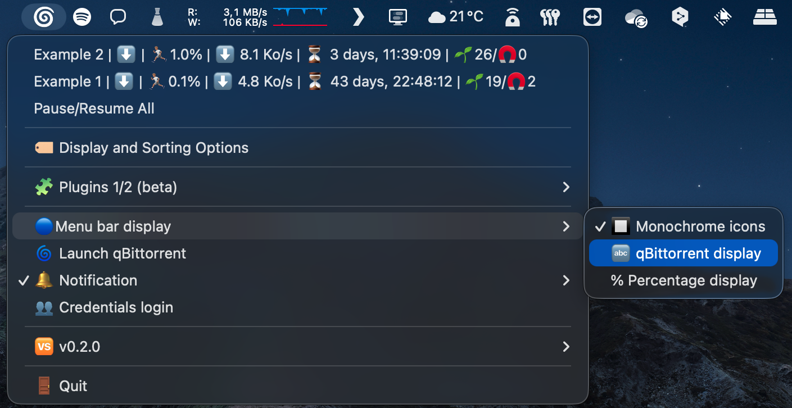
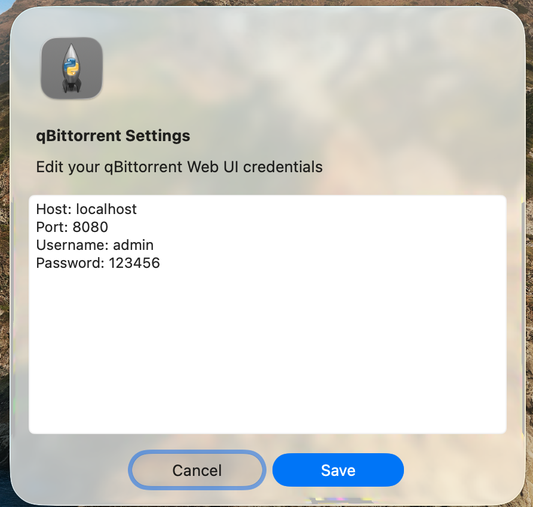

# MacMenu-qBittorrent 🍏


MacMenu-qBittorrent is a lightweight macOS menu bar app that connects to qBittorrent's Web UI and displays active torrents with their progress and other stuff directly in your Mac menu bar.

---

## Features

- Runs natively on macOS as a menu bar application.
- Connects to qBittorrent Web UI via `qbittorrent-api`.
- Launch qBittorent automatically
- Displays all active torrents with progress percentages **and many other stuff** in the menu bar.
- Can Pause/Resume all torrents with one click or one by one (click on it)
- Notifications (with sounds ! 🎵)
- Configuration displaying
- Auto-refreshes torrent status at configurable intervals.
- Configurable connection parameters (host, port, username, password).
- Simple and clean UI using `rumps`.
- Plugin support (beta, no need to hurry...)

---

## Screenshot

- This is the default view:
   

- Status table (see also screenshot):
    
    | Status             | Emoji | Description               |
    |--------------------|-------|---------------------------|
    | allocating         | 📦    | Allocating resources      |
    | checkingDL         | 🔍    | Checking download         |
    | checkingResumeData | 🔍    | Checking resume data      |
    | checkingUP         | 🔍    | Checking upload           |
    | downloading        | ⬇️    | Downloading               |
    | error              | ❌     | Error encountered         |
    | forcedDL           | ⬇️    | Forced download           |
    | forcedUP           | ⬆️    | Forced upload             |
    | metaDL             | 📥    | Metadata download         |
    | missingFiles       | ⚠️    | Missing files             |
    | moving             | 📦    | Moving files              |
    | stoppedDL          | ⏸️    | Download stopped / paused |
    | stoppedUP          | ⏸️    | Upload stopped / paused   |
    | queuedDL           | ⏳     | Queued for download       |
    | queuedUP           | ⏳     | Queued for upload         |
    | stalledDL          | ⚠️    | Download stalled          |
    | stalledUP          | ⚠️    | Upload stalled            |
    | unknown            | ❓     | Unknown status            |
    | uploading          | ⬆️    | Uploading                 |

- Change the order as you wish:

   
   

- Change menu bar display

Monochrome adapts to the Mac's Night/Day lighting. And you can hide "qBittorrent" and the total download percentage.

  


## Install standalone MacMenuqBt (MMqBt)

1. Download [MMqBt.app](https://github.com/Jumitti/MacMenu-qBittorrent/releases)and open the DMG
    
   Double-click the MMqBt.dmg file you downloaded. A window will open showing the contents of the disk image.

2. Drag and drop the app

   In the window, you will see:

   - MMqBt.app – the application itself
   - Applications shortcut – a link to your Applications folder

3. Drag MMqBt.app onto the Applications shortcut. This will copy the app into your Applications folder.

4. Launch MMqBt

   - Open the Applications folder
   - Double-click MMqBt.app to start the app

⚠️ First launch: macOS may warn that the app is from an unidentified developer.

## Setting up MMqBt

When you launch MMqBt for the first time, the app will need to connect to your qBittorrent client.
For this to work, you’ll need to provide the following information in the app’s settings **```Credentials login```**:

Host – The IP address or hostname of the machine running qBittorrent.
(Example: 127.0.0.1 if it’s on the same computer, or your LAN IP if remote.)

Port – The WebUI port configured in qBittorrent (default: 8080).

Username – The username you use to log into the qBittorrent WebUI.

Password – The matching password.

💡 Why is this required?
MMqBt uses qBittorrent’s WebUI API to read torrent information and manage notifications.
Without these credentials, the app cannot access your torrent list or status updates.

Tip:
- Make sure the qBittorrent WebUI is enabled:

    Open qBittorrent → Tools → Options → Web UI.

- Check "Enable the Web User Interface (Remote Control)".

- Note the IP, port, and credentials.

Once set up, MMqBt will remember your credentials locally (they are not sent anywhere else) and will automatically reconnect each time you start the app.




## Installation via PyPI

1. **Ensure you have Python >=3.8 installed on your Mac**

2. **Install the package from PyPI**

    ```bash
    pip install macmenuqbt
    ```

---

## Usage from the command line

Run the app from your terminal (or create a shortcut) — this will start the menu bar app:

```bash
macmenuqbt
# or the alias
mmqbt
```

Available options:
```bash
macmenuqbt --host localhost --port 8080 --username admin --password 123456 --interval 5
```
| Argument     | Alias(s) | Description                     | Default Value |
|--------------|----------|---------------------------------|---------------|
| `--host`     | `-H`     | qBittorrent Web UI host         | `localhost`   |
| `--port`     | `-P`     | qBittorrent Web UI port         | `8080`        |
| `--username` | `-U`     | qBittorrent Web UI username     | `admin`       |
| `--password` | `-PSW`   | qBittorrent Web UI password     | `123456`      |
| `--interval` | `-I`     | Update interval in seconds      | `5`           |
| `--version`  | `-V`     | Show program version and exit   |               |
| `--help`     |          | Show this help message and exit |               |


For help and version:
```bash
macmenuqbt --help 2805
macmenuqbt --version
```

## Usage as a Python module
You can also embed Menubar-qBittorrent in your own Python scripts by calling its main() function with parameters:

```python
from macmenuqbt.core import main as mmqbt

mmqbt(
    host="localhost",
    port=8080,
    username="admin",
    password="123456",
    interval=5,
    qbt=True,
    credentials=True)
```

For **qbt=True/False** and **credentials=True/False**:

Perhaps if you are using MMqBt in another script, you do not want MMqBt to display the option to start 
qBittorrent (qbt) or the login credentials (credentials).


## Notes
Only compatible with macOS due to use of rumps for menu bar integration.

Tested with Python 3.8+ and qBittorrent Web UI 5.x.

Requires qBittorrent Web UI to be enabled and accessible.

## Disclaimer
This tool only displays torrent information; it does not modify or control qBittorrent.

## Contributing
Feel free to open issues or submit pull requests!

## Another qBittorrent plugin

- [TrackersRemover-qBittorent](https://github.com/Jumitti/TrackersRemover-qBittorrent): as expected
