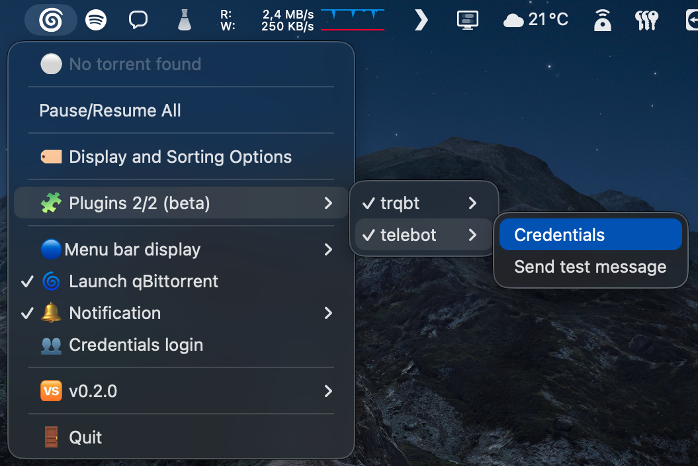
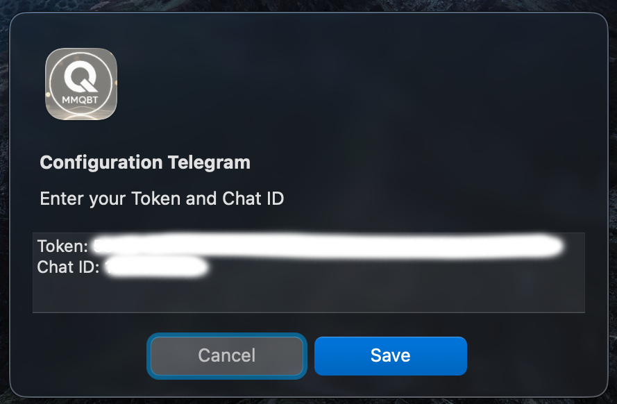

# DISCLAIMER ! ⚠️

This plugin is extremely poorly coded and causes a significant increase in RAM and processor consumption.
I have never experienced lag caused by this plugin, but when in doubt, I prefer to err on the side of caution.

# Telegram Notify plugin for MMqBt

This plugin allows you to receive Telegram notifications about your qBittorrent torrents directly from the **MMqBt** macOS menu bar app.

---

## Features

- Send notifications when torrents finish downloading.
- View a summary of all active torrents via Telegram.
- Test your Telegram bot setup with a single click.
- Fully configurable with Token and Chat ID.
- Supports all torrent statuses with emojis:
  
  | Status              | Emoji | Description                  |
  |---------------------|-------|------------------------------|
  | downloading         | ⬇️    | Downloading                  |
  | resumed             | ⬇️    | Download resumed             |
  | running             | ⬇️    | Running / in progress        |
  | forcedDL            | ⬇️    | Forced download              |
  | seeding             | 🌱    | Seeding (uploading)          |
  | completed           | ✅     | Download completed           |
  | paused              | ⏸️    | Paused                       |
  | stopped             | ⏸️    | Stopped                      |
  | inactive            | ⏸️    | Inactive                     |
  | active              | 🔄    | Active / operation in progress |
  | stalled             | ⚠️    | Stalled / waiting            |
  | stalled_uploading   | ⚠️    | Upload stalled               |
  | stalled_downloading | ⚠️    | Download stalled             |
  | checking            | 🔍    | Checking files               |
  | moving              | 📦    | Moving files                 |
  | errored             | ❌     | Error encountered            |
  | all                 | 📋    | All torrents                 |
  | unknown             | ❓     | Unknown status               |

---

## Installation

1. Copy the `telegram_notify.py` plugin into your MMqBt `plugins` directory (just click on "🧩 Plugins" in MMqBt).
2. The plugin will appear under the **Plugins** menu.
3. Activate by clicking on it, you should see a "✔️"
4. Restart MMqBt

---

## Configuration

1. Go to **Plugins → Telegram Notify (ex telebot)→ Credentials**.



2. Enter your Telegram bot **Token** and **Chat ID** in the window that appears.

   1. How to get your **Chat ID**:
      - send ```/getid``` to [@myidbot](https://telegram.me/myidbot) on [Telegram](https://web.telegram.org/k/)
   2. How to get your **TOKEN**:
      - Config a bot with [@BotFather](https://telegram.me/BotFather):
        - Create a bot with ```/newbot``` and follow instructions
        - Get API token with ```/mybots```, select your bot and get API token
      - Don't forget to send ```/start``` at your Telegram bot



3. Click **Save**.
4. You can test the setup with **Plugins → Telegram Notify → Send test message**.

> ⚠️ Make sure both Token and Chat ID are valid. The plugin will alert you if the configuration is incorrect.

---

## Usage

- The plugin automatically starts a Telegram listener.
- Sends notifications when a torrent finishes.
- You can request the current torrent list in Telegram by sending the `/list` command to your bot.


---

## Settings File

The plugin stores its configuration in the same folder of plugins

