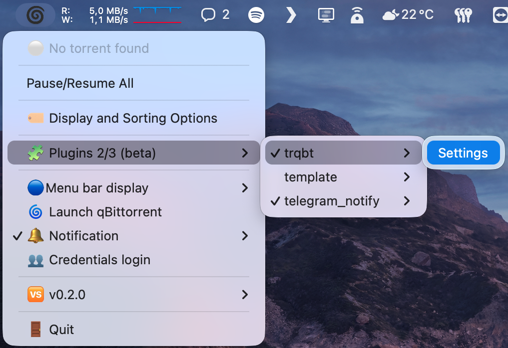
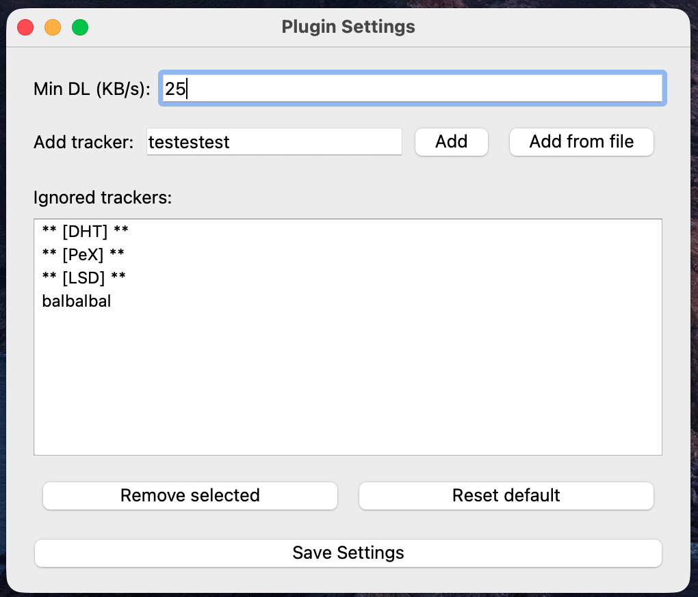

# DISCLAIMER ! ⚠️

This plugin modifies torrent trackers automatically, which goes **against normal P2P sharing practices**.  
It is provided as an **[adaptation of one of my other personal projects](https://github.com/Jumitti/TrackersRemover-qBittorrent)**.  
Use responsibly and at your own risk.

# trqbt plugin for MMqBt

This plugin allows you to automatically remove trackers from torrents that exceed a configurable minimum download speed.

Author: [@Jumitti](https://github.com/Jumitti)

---

## Features

- Automatically removes trackers from torrents that are downloading faster than a defined threshold.
- Configurable minimum download speed (Kb/s) before removing trackers.
- Ignores common P2P network trackers like DHT, PeX, and LSD.
- Simple configuration window accessible from the MMqBt Plugins menu.
- Notifications when a tracker is removed.

---

## Installation

1. Copy the `trqbt.py` plugin into your MMqBt `plugins` directory (just click on "🧩 Plugins" in MMqBt).
2. The plugin will appear under the **Plugins** menu.
3. Activate by clicking on it, you should see a "✔️"
4. Restart MMqBt

---

## Configuration

1. Go to **Plugins → trqbt → Settings**.
2. Enter the minimum download speed threshold in Kb/s (default: 10).
3. Add trackers ignored if necessary.
3. Click **Save**.
4. The plugin will automatically remove trackers exceeding this threshold.




You can also add a torrent list with a .txt file like this:
```bash
http://tracker1.example.com:6969/announce
http://tracker2.example.net:8080/announce
```

---

## Settings File

The plugin stores its configuration in the same folder of plugins

